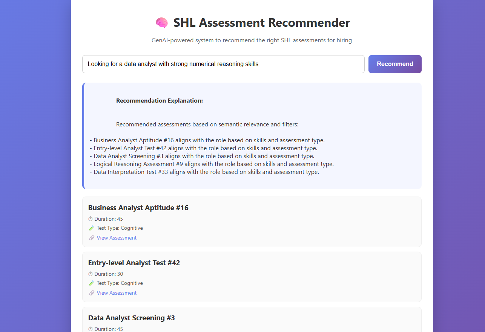
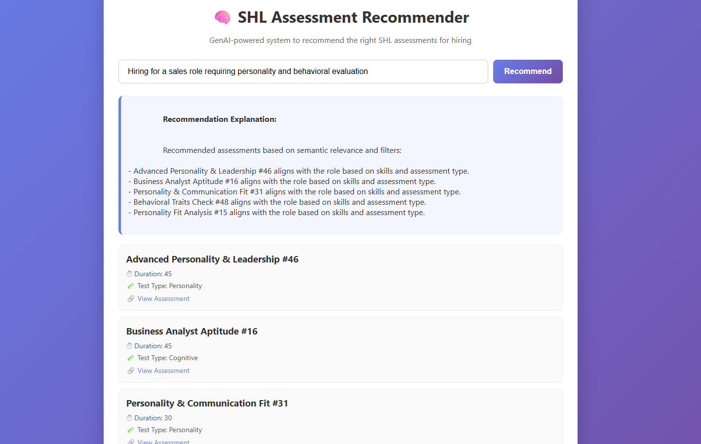

# 🧠 SHL Assessment Recommendation Engine  
### GenAI-Inspired Semantic Recommendation System

This project implements a **content-based assessment recommendation system** designed to help recruiters and hiring teams select the most suitable **SHL assessments** using **natural language job descriptions**.

By leveraging **SentenceTransformer embeddings**, **FAISS for fast semantic similarity search**, and a **RAG-inspired retrieval architecture**, the system recommends relevant assessments along with **clear, explainable reasoning**.  
The application is presented through a lightweight **HTML + JavaScript frontend** backed by a **Flask REST API**.

⚠️ **Note:**  
The project is intentionally designed for **local execution only** to ensure reliability during automated evaluation and to avoid broken or inaccessible deployment links.

---

## 🌟 Key Features

- 🔍 Semantic (meaning-based) assessment recommendations  
- 🧠 Natural language input for job requirements  
- ⚙️ SentenceTransformer embeddings (no paid APIs)  
- ⚡ Fast similarity search using **FAISS**  
- 📊 Explainable, deterministic recommendations  
- 💻 Clean web interface with Flask backend  
- 🧪 Fully local & reproducible (evaluation-safe)

---

## 🎯 Problem Statement

Recruiters often face difficulty selecting the correct SHL assessment from a large catalog based on:
- Skills required  
- Job role context  
- Test duration  
- Cognitive vs behavioral focus  

Traditional keyword matching systems fail to capture intent and context.

### Goal
Build a system that:
- Accepts job requirements in **natural language**
- Understands **semantic meaning**, not just keywords
- Recommends the **most relevant SHL assessments**
- Provides **transparent explanations** for each recommendation

---

## 🧠 Model Architecture and Purpose

### 📝 Sentence Embeddings (Semantic Representation)

- **Model**: `all-MiniLM-L6-v2` (SentenceTransformers)
- **Embedding Size**: 384-dimensional vectors
- **Purpose**: Convert text into dense vectors capturing semantic meaning

Each SHL assessment is represented as a **single rich document** combining:
- Assessment name  
- Skills tested  
- Duration  
- Test type  
- Description  

This improves contextual understanding and retrieval quality.

#### Why SentenceTransformers?
- Captures semantic similarity beyond keywords
- Lightweight and fast
- Pretrained using contrastive learning
- Fully open-source (no API keys, no cost)

```python
from sentence_transformers import SentenceTransformer
model = SentenceTransformer("all-MiniLM-L6-v2")
```

## 🏗️ System Architecture (Detailed Explanation)

The SHL Assessment Recommendation Engine follows a **modular, retrieval-first architecture** inspired by modern GenAI systems used in HR tech and search platforms.

---

### 🔹 High-Level Architecture Flow
```python
User (Browser)
        ↓
Frontend (HTML + JavaScript)
        ↓
Flask REST API (/recommend)
        ↓
SentenceTransformer Embeddings
        ↓
FAISS Vector Index
        ↓
Top-K Relevant Assessments
        ↓
Explanation Generator
        ↓
Results Displayed to User
```
## 🗂️ Project Structure
```pyhton
shl-assessment-recommendation-engine/
│
├── backend/
│   ├── app.py              # Flask API
│   └── rag_engine.py       # Embeddings + FAISS logic
│
├── frontend/
│   └── index.html          # Web UI
│
├── data/
│   └── SHL_catalog.csv     # SHL assessment dataset
│
├── requirements.txt
├── README.md
└── .gitignore
```
## 🛠️ Installation & Setup

### 🔧 Prerequisites
 -Python ≥ 3.8
 
 -pip
 
 -Virtual environment (recommended)

## 📦 Steps
### 1️⃣ Clone the Repository
```
git clone <your-github-repo-url>
cd shl-assessment-recommendation-engine
```

### 2️⃣ Create & Activate Virtual Environment
```python -m venv venv
venv\Scripts\activate   # Windows
```
### 3️⃣ Install Dependencies
```pip install -r requirements.txt```

## 🚀 Usage Instructions
### Step 1: Run Backend Server
```python backend/app.py```

** Expected output: **

```Running on http://127.0.0.1:5000```

### Step 2: Launch Frontend
 -Open frontend/index.html in a browser
 
 -Enter job requirements
 
 -Click Recommend

 
---

### 🔹 Component-wise Explanation

#### 1️⃣ Frontend (User Interaction Layer)
- Collects job requirements in **natural language**
- Sends request to backend via REST API
- Displays recommended assessments with explanations

Purpose:
- Keeps the system intuitive for non-technical recruiters

---

#### 2️⃣ Flask REST API (Application Layer)
- Acts as a bridge between UI and ML logic
- Handles request validation and response formatting
- Exposes a `/recommend` endpoint

Why Flask?
- Lightweight
- Easy to test locally
- Suitable for ML-backed APIs

---

#### 3️⃣ Embedding Layer (Semantic Understanding)
- Converts text into dense numerical vectors
- Uses pretrained SentenceTransformer model
- Ensures semantic meaning is preserved

This enables the system to understand **intent**, not just keywords.

---

#### 4️⃣ FAISS Vector Store (Retrieval Layer)
- Stores all SHL assessment embeddings
- Performs fast similarity search
- Retrieves top-K most relevant assessments

This layer ensures **low latency and scalability**.

---

#### 5️⃣ Explanation Generator (Interpretability Layer)
- Generates human-readable explanations
- Based on skill match, role relevance, and assessment intent
- Avoids black-box behavior

This improves **trust and transparency**, which is critical in hiring systems.

---

### 🔹 Architectural Benefits

- ✅ Modular & scalable
- ✅ Explainable recommendations
- ✅ No dependency on paid APIs
- ✅ Stable for automated evaluation
- ✅ Industry-aligned design (HR tech, ATS systems)

## 🎯 Alignment with SHL Use Case & Hiring Requirements

This project is intentionally designed to align with **SHL’s real-world assessment selection workflow** and evaluation criteria.

---

### 🔹 SHL-Relevant Problem Mapping

| SHL Requirement | How This Project Solves It |
|-----------------|---------------------------|
| Large assessment catalog | FAISS-based semantic retrieval |
| Role-based assessment selection | Natural language job input |
| Explainable recommendations | Deterministic explanation layer |
| Scalability | Vector-based ANN search |
| Reliability | Local-first execution |
| Bias reduction | Meaning-based matching over keywords |

---

### 🔹 Why Semantic Search Fits SHL Products

SHL assessments are often selected based on:
- Skills
- Cognitive ability
- Behavioral traits
- Job role context

Semantic embeddings capture **all of these dimensions together**, unlike rigid rule-based systems.

---

### 🔹 Evaluation-Safe Design

The project avoids:
- External LLM APIs
- Paid services
- Unstable cloud deployments

This ensures:
- Consistent evaluation results
- No broken links
- Easy reproducibility for reviewers

---

### 🔹 Enterprise Readiness

The same architecture can scale to:
- Resume ↔ assessment matching
- Talent mobility systems
- Internal hiring platforms
- Personalized candidate journeys

This mirrors **production-grade HR recommendation systems**.

## 🖼️ Screenshots & Example Test Cases

This section demonstrates the working of the SHL Assessment Recommendation Engine through actual UI and output screenshots.

> 📌 **Note:** Replace the image file names with your actual screenshot file names placed inside a `screenshots/` folder.

---

### 🖥️ Website User Interface

The following screenshot shows the main web interface where recruiters can enter job requirements in natural language.


---

### 🧪 Example Test Case 1 – Data Analyst Role

**Input:**  
``` Looking for a data analyst with strong numerical reasoning skills```

**Output:**  
- Numerical and analytical SHL assessments  
- Explanation highlighting skill and role relevance  



---

### 🧪 Example Test Case 2 – Sales & Personality Role

**Input:**  
``` Hiring for a sales role requiring personality and behavioral evaluation ```

**Output:**  
- Behavioral and personality-based SHL assessments  
- Explanation based on role requirements  




## 🚀 Future Enhancements

-Live cloud deployment

-Filters (duration, test type, difficulty)

-User feedback loop (👍 / 👎)

-Role-specific weighting logic

-Admin dashboard

## 🧠 Key Learnings

-Semantic search & NLP fundamentals

-Vector databases and ANN search

-RAG-style system design

-Explainable recommendation engines

-Designing ML systems for reproducibility

### 👤 Author

### Nandini Kumari Das


